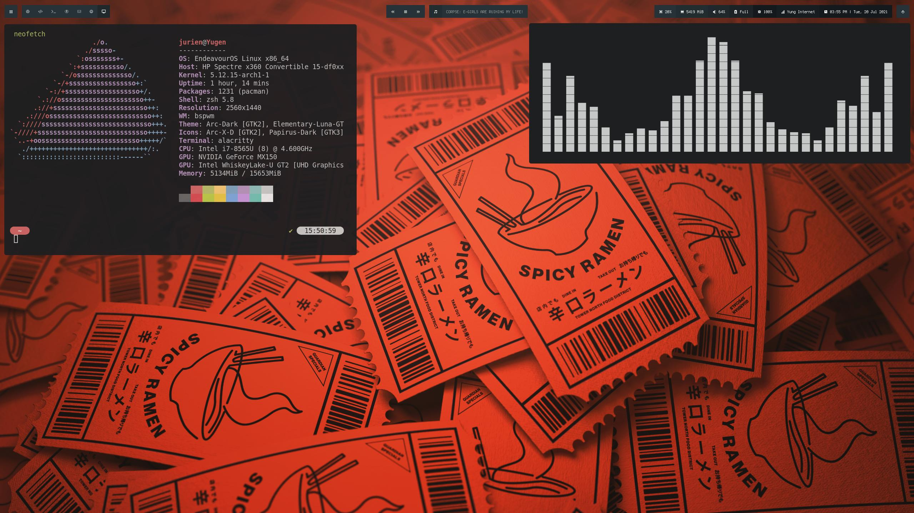

### Dotfiles

This repository contains my personal dotfiles.

[You can find the wallpaper here](./.misc/wallpaper.jpg)

#### Setup

- BSPWM and SXHKD configuration and keybindings
- Polybar configuration and scripts
- Rofi configuration and scripts
- A custom .Xresources color palette
- alacritty color scheme and configuration
- zsh configuration and custom color scheme based on powerlevel10k
- dunst notifications
- picom configuration
- Custom themes for different applications (Spotify, Discord, Telegram Desktop...)

#### Screenshot

