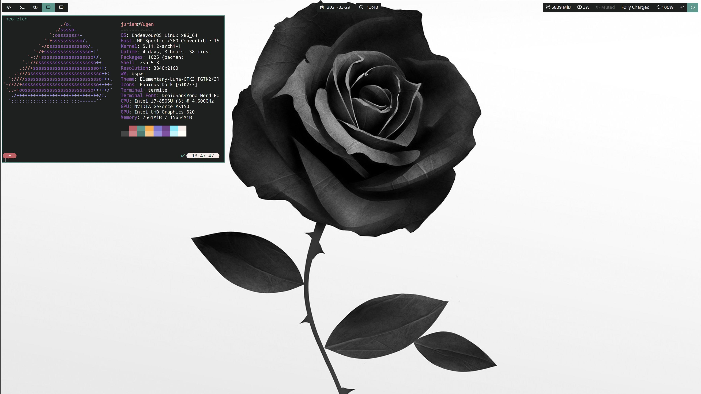

### Dotfiles

This repository contains my personal dotfiles.

[You can find the wallpaper here](./.misc/wallpaper.jpg)

#### Setup

Here is a collection of my personal dotfiles, which include, this is based on 

-   BSPWM and SXHKD configuration and keybindings
-   Polybar configuration and scripts
-   A custom .Xresources color palette
-   Four GTK theme variants based on the theme color scheme (made with oomox)
-   rofi custom menus and configurations
-   termite color scheme and configuration
-   zsh configuration and custom color scheme based on powerlevel10k
-   dunst notifications
-   picom configuration
-   Custom themes for different applications (Spotify, Discord, Telegram Desktop...)

#### Screenshot

